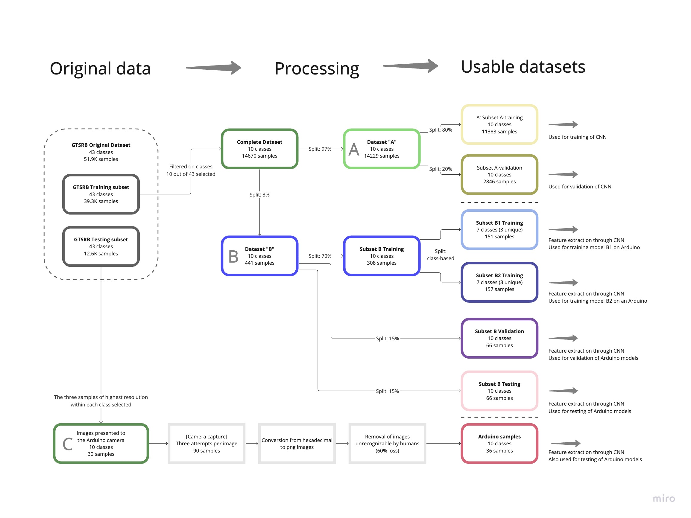
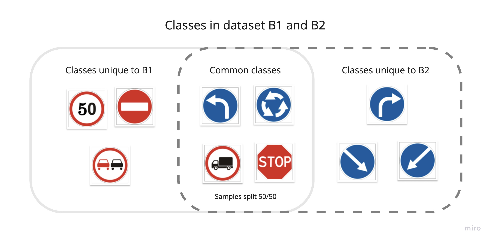
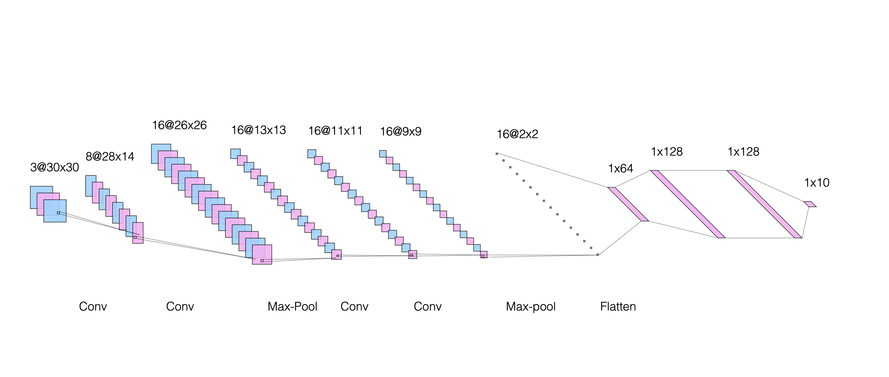
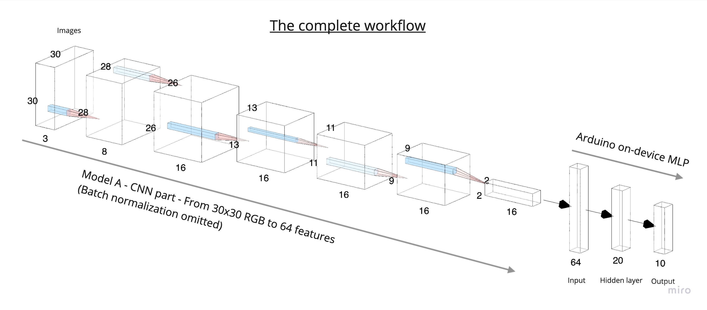
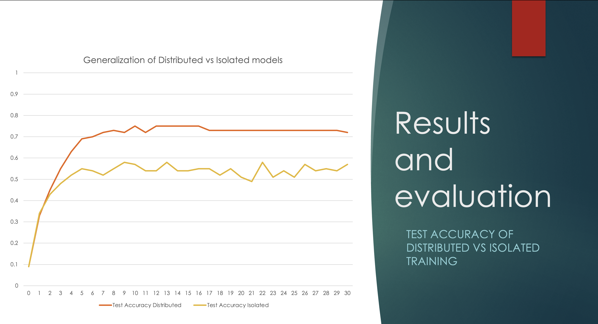

# road_sign_detection_on_arduino_with_tensorflow
**Project done by: Joel Bengs & Fabian Rosén**
Building an ML model for road sign detection on Arduino. Challenges include limited memory, limited computing power and limited energy. Final project in the course ML for IoT, EITP40, 2023. C++ code for the Arduino devices provided by the teacher assistant was developed by Nikhil Challa and Simon Erlandsson as part of the course ML in IOT, 2022, available at [this Github repo](https://github.com/niil87/Machine-Learning-for-IOT---Fall-2022-Batch-Lund-University).

## Overview of the Project
This project centers on crafting an intelligent traffic sign recognition model that can run on Arduino devices. Starting from the GTSRB roadsign dataset, we create seven distinct datasets for training, validation, and testing. A Convolutional Neural Network was trained (in Kaggle) and then used to process data, creating 64-feature representations compatible with the limited memory on the Arduino. Small Multi-layer Perceptrons were trained on the device and evaluated both against a high-quality dataset and images captured with the Arduino’s own camera.

Results showcased successful single-device training and improved performance in distributed training. Challenges arose from low-quality Arduino-captured images. In summary, the project successfully demonstrated machine learning integration on Arduino for practical traffic sign recognition and the benefit of distributed learning.

## Data
The GTSRB dataset was used in the following manner.

To facilitate distributed learning, this strategy was used.

## Models

## Results
Our short project report can be downloaded here: [Download PDF Report](./assets/report.pdf)

A powerpoint presentation can be found here: [Download PowerPoint Presentation](./assets/presentation.pptx)

Here is a [Video Demo](https://youtu.be/5cZI-IUS61U)

## Git Folder and File Structure:
Explanation of the purpose of most of the folders/files in the repository.
- Processed data files
  - Data produced through the data processing pipeline
- arduino-images
  - Images captured with the camera module on the Arduino device
- distributed_ml_two_devices
  - Code for training ML networks on two Arduino devices using shared weights
  - Code developed by Nikhil Challa and Simon Erlandsson as part of the course ML in IOT, 2022 (https://github.com/niil87/Machine-Learning-for-IOT---Fall-2022-Batch-Lund-University)
- isolated_ml_one_device
  - Code for training a ML network on one Arduino device
- take_pictures
  - Code for capturing images using an arduino device and transforming the hexadecimal code to a PNG-picture
  - Code developed by Harvard University
- kaggle_notebook_data_processing.ipynb
  - Code for data processing developed in Kaggle
